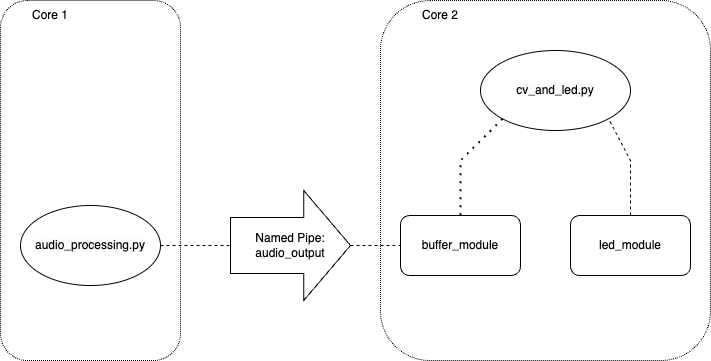

# Team6

This is the directory for Team 6's code.

The audio directory contains all files used to test various forms and implementations of pitch detection. (Enoch)

The led-dev directory contains files necessary to program the LED strip. (Kai)

The pose directory contains files necessary to run the pose detection program. (Yogi)

The dashboard directory contains the scripts used to create the computer-based dashboard (Daniel).


# Requirements

Use `pip install -r requirements.txt` to install all the necessary packages.

Packages include:
```
# LED
rpi_ws281x==5.0.0
adafruit-circuitpython-neopixel
adafruit-blinka

# Audio
sounddevice
librosa
pyaudio

# Camera
scikit-learn
cv2

# Misc
scipy
matplotlib
numpy
paho-mqtt
pickle
threading
```

# Running the code
Use `startup.sh` to run the code. This will:
1. Create the named pipe
2. Run the audio processing script
3. Run the CV + LED processing script
4. Clean up the named pipe when either of the scripts are stopped

# Methodology



